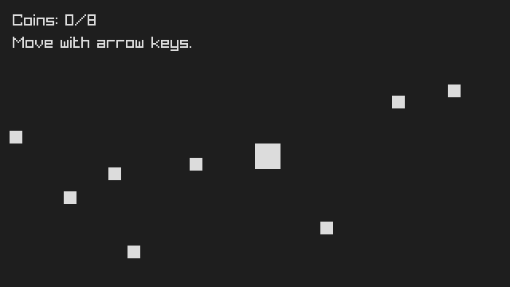
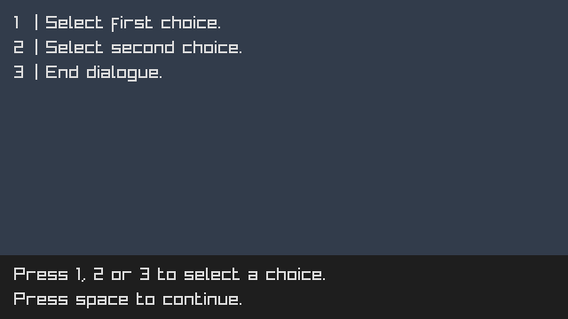
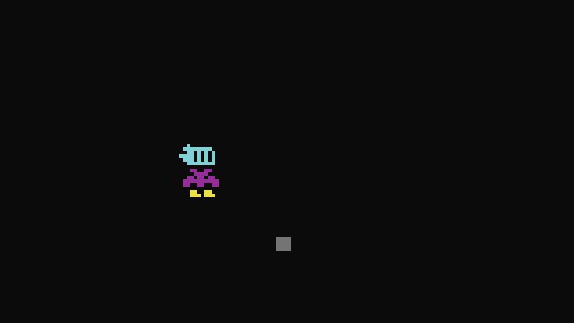
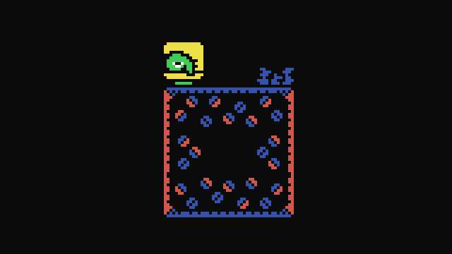

# Examples

> [!NOTE]
> For examples that use sprites, you must download the [atlas.png](atlas.png) file and save it in your project's assets folder.

## [Hello](hello.d)

This example serves as a classic hello-world program, introducing the fundamental structure of a Popka program.

## [Coins](coins.d)

This example shows how to create a simple game with Popka.

## [Pong](pong.d)

This example shows how to create a pong-like game with Popka.

## [Camera](camera.d)

This example shows how to use the camera structure of Popka.

## [Dialogue](dialogue.d)

This example shows how to use the Popka dialogue system.

## [Follower](follower.d)

This example shows how to create an animated character that follows the mouse.

## [Map](map.d)

This example shows how to use the tile map structure of Popka.

